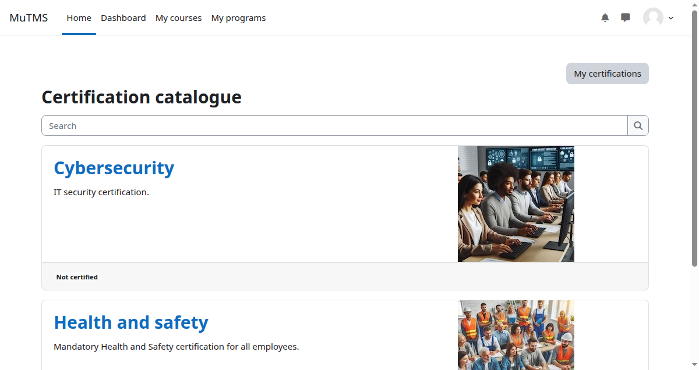

:::note
The Certification catalogue will be replaced by a Universal catalogue plugin in a future release.
:::

The certification catalogue is a central place where users can explore and interact with available
certifications. It supports multiple assignment sources, providing flexibility in how users are assigned.

The catalogue can be accessed from the [My certifications](../my-certifications-page/) profile page.

Visibility is managed through the [certification management interface](../management/#visibility). Archived
certifications are never shown in the catalogue. Tenant separation rules are always enforced.

