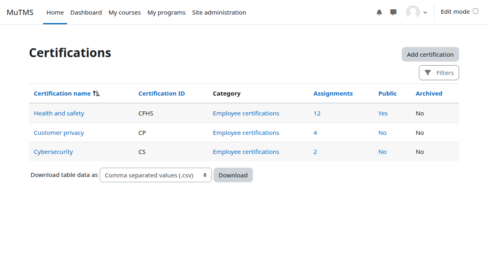
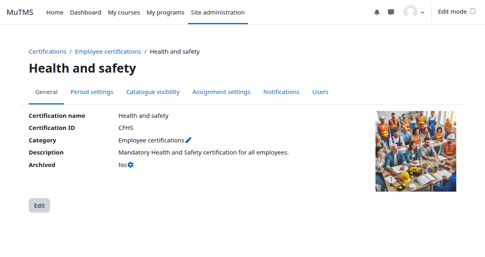
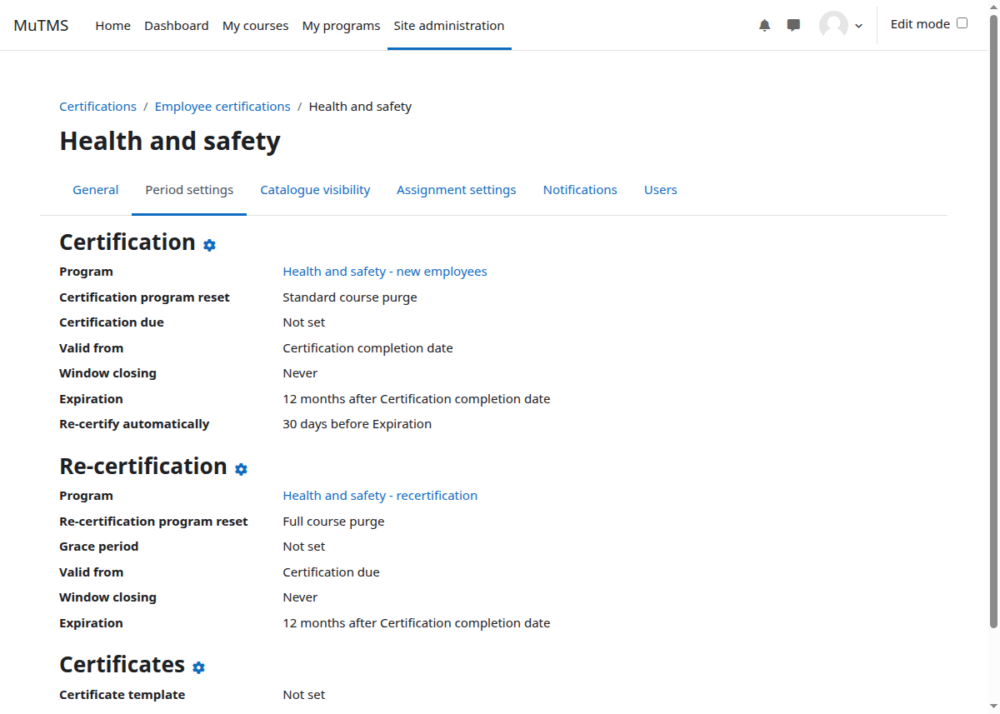
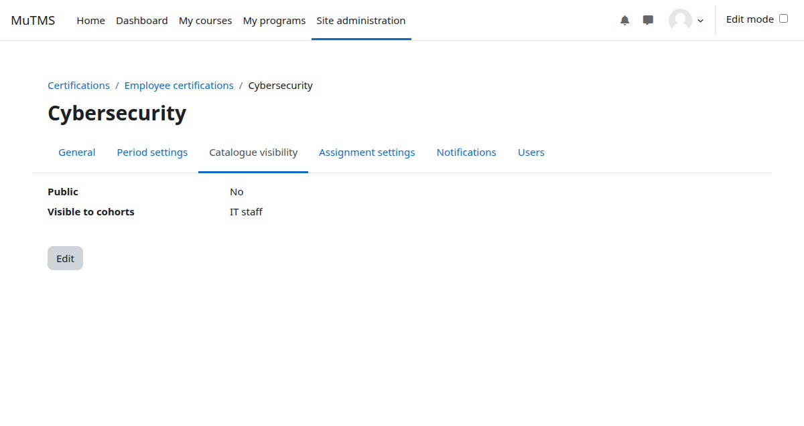
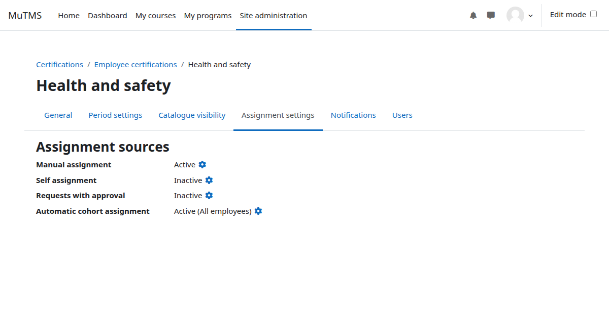
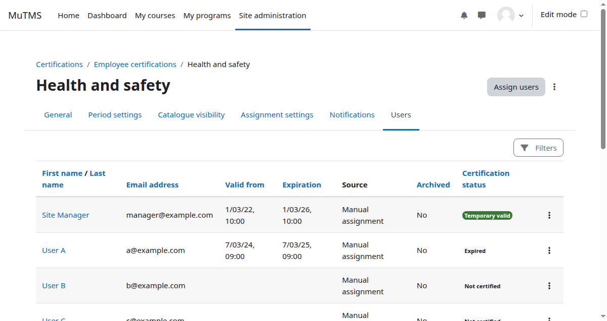
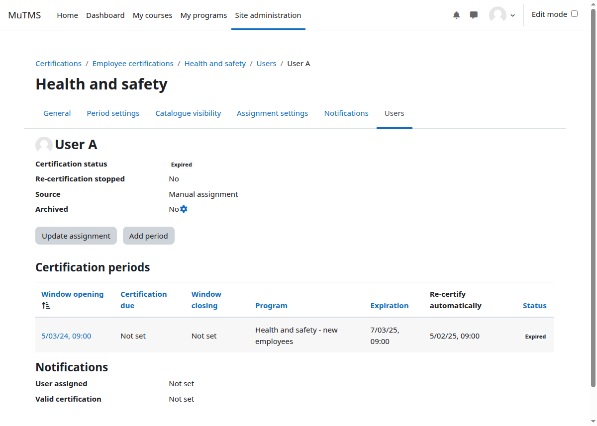

Certifications can be created at either the system or course category context level. Access to the
certification management interface is, by default, limited to users with Manager or Editing teacher roles.

## Accessing certification management

The certification management interface is very similar to the [program management](../../programs/management/)
interface. It can be reached via three routes depending on the user's role and context:

- **Site Managers** can navigate directly via **Site administration > Certifications > Certification management**.
- Users with the **View certification management** capability in system context may alternatively open the
  **Certification catalogue** from the My certifications profile page or dashboard block, then press the
  **Certification management** button.
- Users with **View certification management** capability scoped to a specific category only can navigate
  to the relevant course category management or browsing page and click the **Certifications** link in the
  secondary navigation menu.

## Management capabilities

Certification management capabilities define the level of access and permissions for different operations.

| Capability | Description |
| --- | --- |
| View certification management | Browse certifications at the system or course category level, view certification details, and assigned users. |
| Add and update certifications | Create new certifications and modify the settings of existing ones. |
| Delete certifications | Delete certifications, periods, and related user data. |
| Assign users to certifications | Assign users manually and restore assignment. Depends on assignment source logic. |
| Unassign users from certifications | Manually unassign users and archive assignments. Depends on assignment source logic. |
| Configure certification custom fields | System level capability — configure certification custom fields. |
| Advanced certification administration | Carry out specialised, high-risk operations related to certifications and assignments. |

## Certification settings

Certifications, like programs, are identified by their names and unique ID numbers. They can be created at
the system context level or within a specific category context.

Entire certifications or individual user assignments can be set to an archived status. Archiving pauses user
progress in associated programs and makes the certification invisible to regular users.

## Period settings

A certification period refers to the duration for which a certification remains valid. Once a certification
expires, users may need to recertify by completing the necessary requirements again.

Each certification period includes a **certification window**, which defines when the associated program is
open to the user:

- **Window opening date** — when the program becomes available to the user.
- **Certification due date** — the expected date for program completion.
- **Window closing date** — when the program closes, even if not yet completed.

Each valid period also has the following key dates, which are usually determined when the certification
period is completed:

- **Valid from date** — the starting date when the certification is considered valid.
- **Expiration date** — the date when the certification becomes invalid.
- **Re-certification date** — an optional date indicating when re-certification becomes available.

Window dates are calculated when a new certification period is created.

## Visibility

Certification visibility in the catalogue is not influenced by roles, capabilities, or contexts. Instead,
visibility is controlled either by cohort membership or by making the certification publicly accessible to
all users.

Archived certifications are never shown in the certification catalogue.

Visibility is managed through two settings:

- **Public flag** — when set to "Yes", all site users can view the certification in the catalogue. If
  multi-tenancy is active, tenant separation is strictly enforced.
- **Visible to cohorts** — only members of specified cohorts can view the certification in the catalogue.

Regardless of these settings, users can always see all certifications assigned to them in the catalogue.

:::note
The *My Certifications* profile page and block display all certifications assigned to a user irrespective of
visibility settings, unless the certification or assignment is marked as archived. During the certification
window, certification programs are also visible in the *My programs* profile page and dashboard block.
:::

## Assignment settings

Users may be assigned to a certification through the following sources:

- **Manual assignment** — a manager with the *Assign users to certifications* capability in certification
  context may manually assign users.
- **Self assignment** — users can self-assign by clicking a button in the Certification catalogue. An
  optional access key and maximum user limit may be applied.
- **Request with approval** — users can request assignment via the Certification catalogue, subject to
  approval by a manager.
- **Automatic cohort assignment** — all members of specified cohorts are automatically assigned to the
  certification.

When a user is assigned, a first certification period is created and a certification window opens.

## Certification users

The assigned users page provides a comprehensive overview of all users' certification state.

Individual user assignment details can be accessed by clicking on the corresponding user link, providing an
overview of that user's certification periods and general status.

