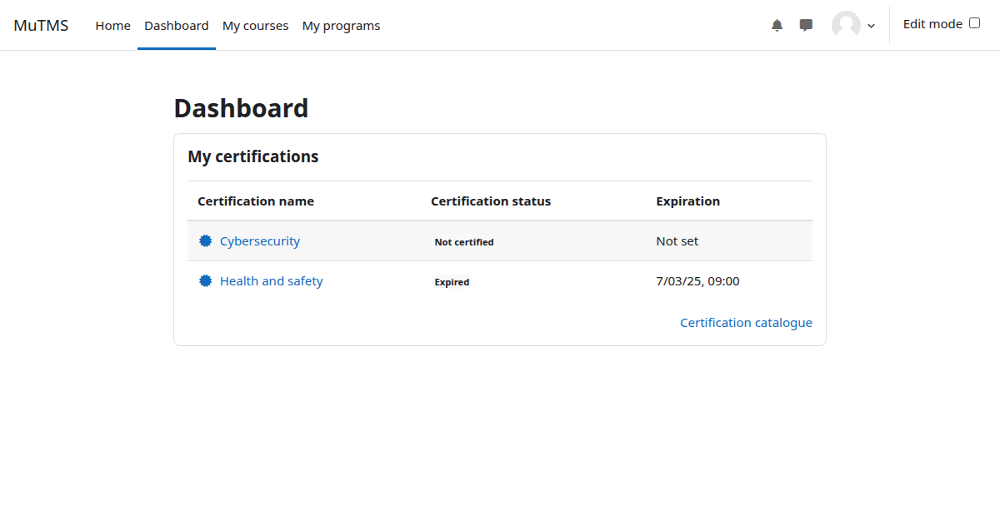

The *My certifications* block allows users to stay informed about their assigned certifications directly
from their dashboard, giving quick access to all allocated certifications and helping them track their
compliance status.

