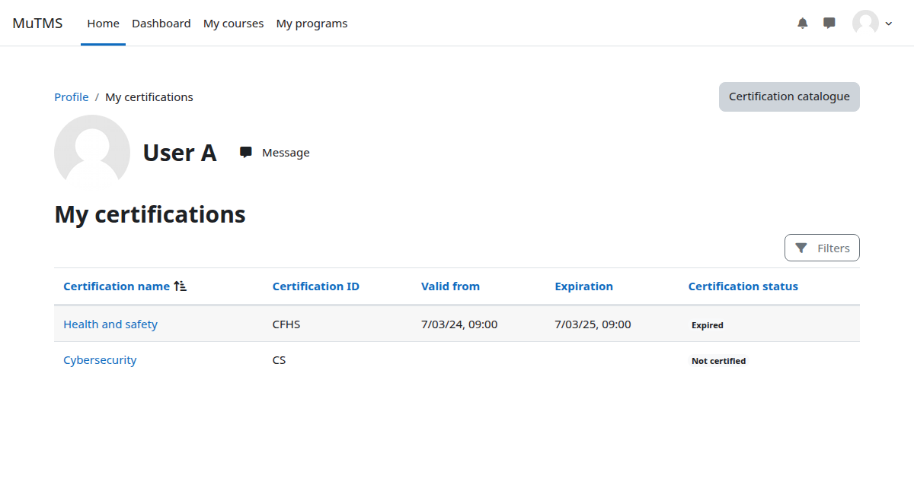
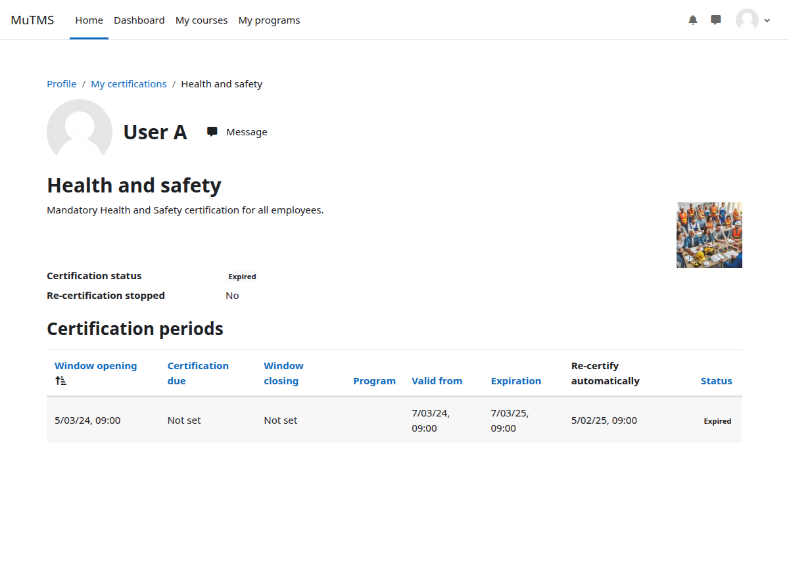

The *My certifications* page on the user profile shows all certifications a user is assigned to.
Certifications are not shown if the assignment or the certification itself is marked as archived.

Users can access certification details and status by clicking on the respective certification links.

