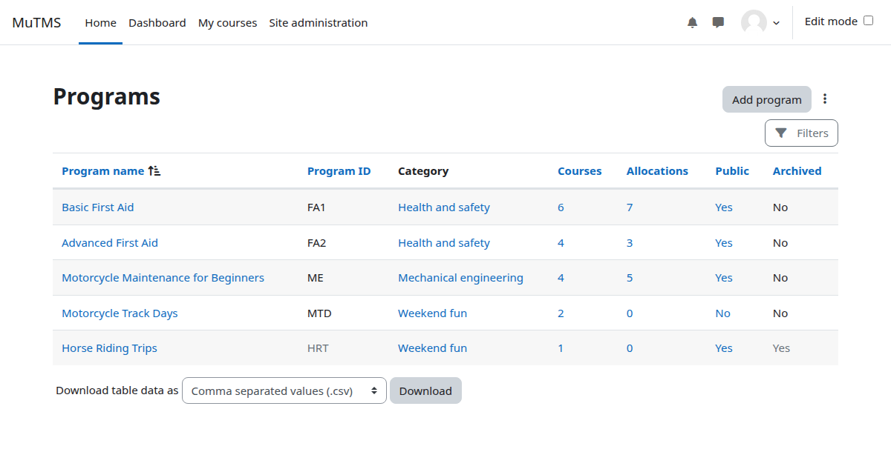
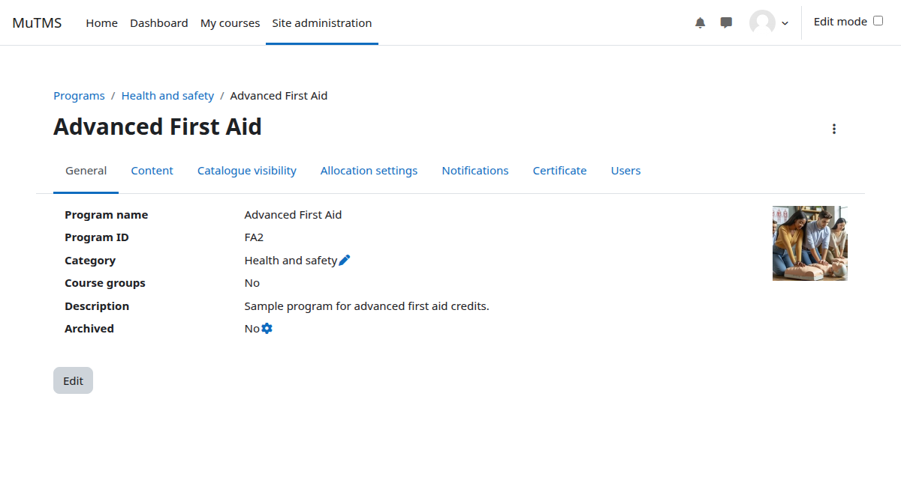
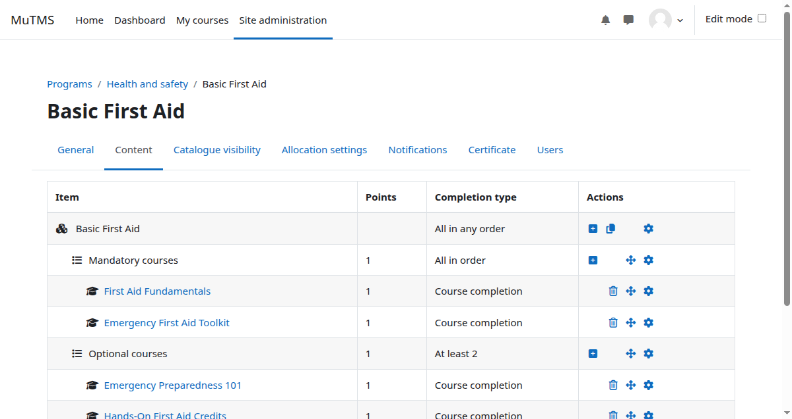
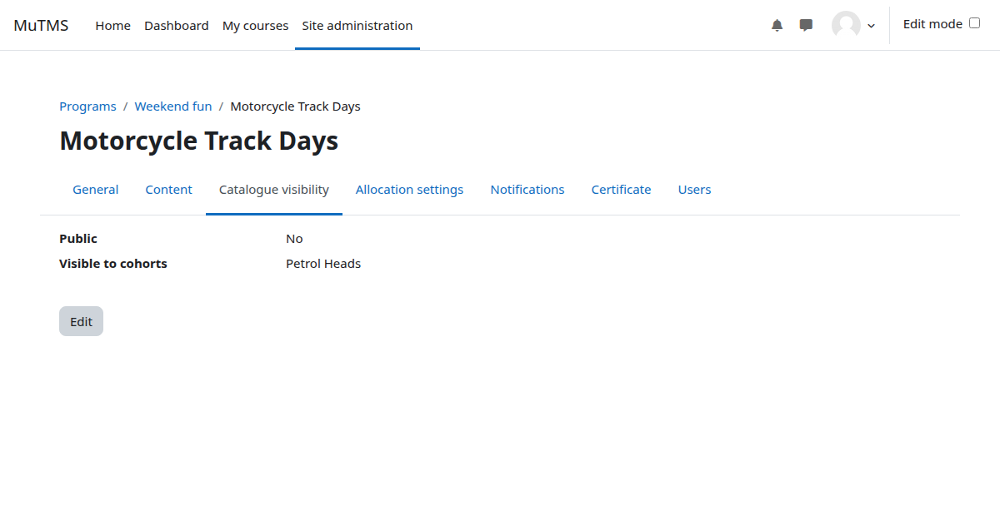
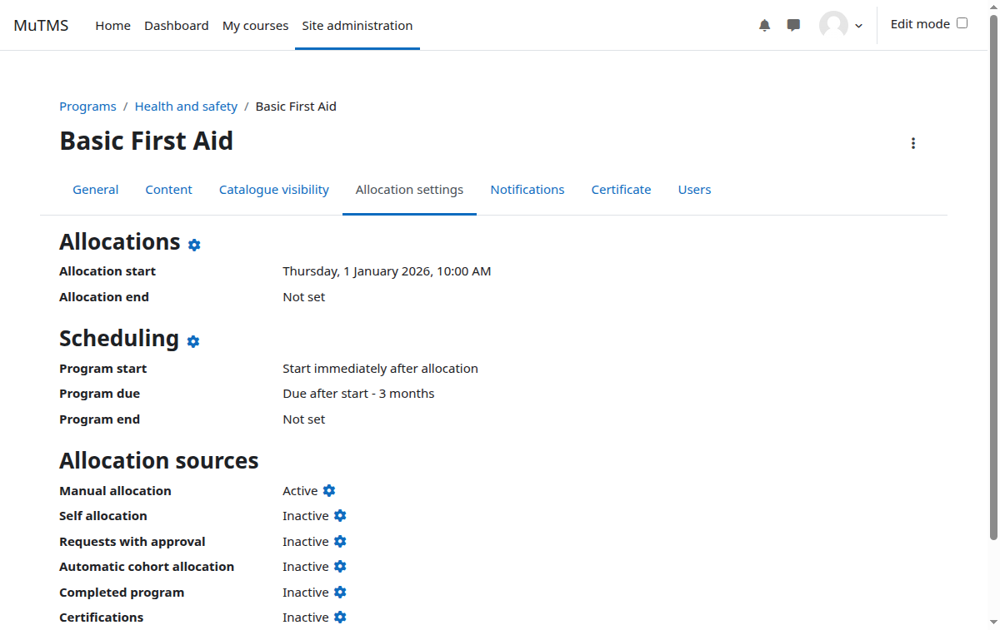
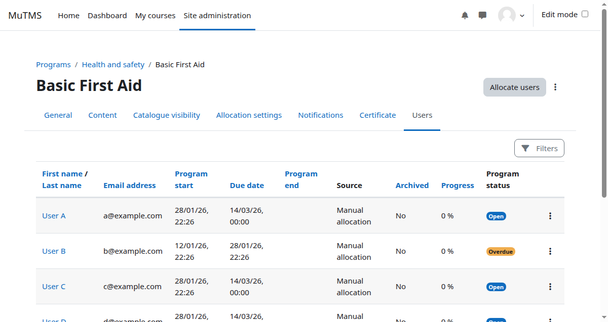
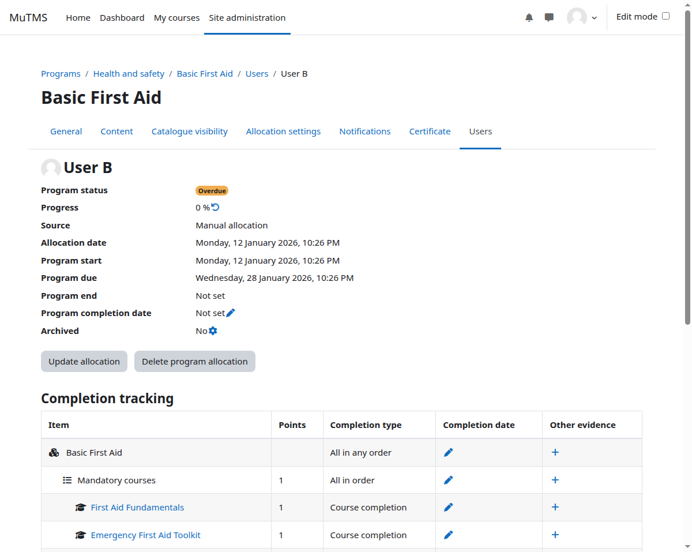

Programs can be created at either the system or course category context level.
Access to the program management interface is, by default, limited to users
with Manager or Editing teacher roles.

## Accessing program management

- **Site managers** can reach the interface via **Site administration > Programs > Program management**
- Users with the **View program management** capability in system context can alternatively:
    - Click **Program catalogue** in the My Programs profile page or dashboard block, then press **Program management**
- Users with **View program management** capability in a specific category only can:
    - Navigate to the relevant course category page and click **Programs** in the secondary navigation menu

## Management capabilities

| Capability | Description |
| --- | --- |
| View program management | Browse programs, view program details and allocated users |
| Add and update programs | Create new programs and modify existing ones |
| Clone program content and settings | Clone content and settings from one program to another |
| Export programs | Export program content and settings |
| Upload programs | Upload programs, their content and settings |
| Add course to programs | Course-level capability — allows adding a course to a program |
| Delete programs | Delete programs and all associated user allocations |
| Allocate users to programs | Allocate users manually and restore archived allocations |
| De-allocate users from programs | Remove and archive user allocations |
| Manage user allocations | Update user allocation start, due, and end dates |
| Manage other completion evidence | Provide alternative completion evidence for courses or course sets |
| Reset program progress | Reset users' progress by purging course data and completions |
| Add program to certifications | Use program in certification periods |
| Configure program custom fields | Configure program custom fields (system level) |
| Advanced program administration | Carry out specialised, high-risk operations on programs and allocations |

## Program settings

Programs are identified by their name and a unique ID number, and can be
created in either system or category context.

When the course groups option is used with a separate group mode, enrolment
responsibilities can be delegated to different trainers, each managing only
their own group.

Entire programs or individual user allocations can be archived. Archiving
halts user progress in program courses and removes the program from the
catalogue and learners' view.

## Program content

Program content is structured hierarchically, with each set comprising
individual courses, training frameworks, or nested sets. A program is marked
complete when the allocated user successfully completes the top-level set.

### Course items

Program users are automatically enrolled in all program courses. Enrolments
remain suspended until the program begins or sequencing rules permit access.

:::caution
Modifying the program structure after users have been allocated may lead to
unexpected enrolment behaviour or inconsistencies in course access.
Unallocating and reallocating a user may result in the loss of their course
data due to automatic unenrolment.
:::

### Item sets

Completion of a set can follow one of the following criteria:

- **All in any order** — all items must be completed, in any order
- **All in order** — all items must be completed in sequence; the next item
  becomes accessible only after the previous one is completed
- **At least X** — a minimum number of items must be completed
- **Minimum X points** — a minimum point threshold must be achieved

### Credit items

Training credits are a separate concept from program item points. To use
credits as items in programs you need to install the
[Training credits](../../credits/) plugin.

Credit items are designed for scenarios where users are already enrolled in
a large number of optional courses, or where self-enrolment is enabled.
Rather than automatically enrolling users in courses, credit items require
learners to accumulate a specified number of credits — giving them the
freedom to choose their own path from a catalogue of optional courses.

## Program visibility

Program visibility in the catalogue is not controlled by roles or capabilities.
Instead, it can be restricted to cohort members or made publicly accessible.
If a user can view a program, they can also see its associated courses even if
those courses are hidden elsewhere. Archived programs are never visible in the
catalogue.

Visibility is managed through two settings:

- **Public** — when set to Yes, all site users can view the program in the
  catalogue; tenant separation is enforced if multi-tenancy is active
- **Visible to cohorts** — only members of specified cohorts can view the
  program in the catalogue

Users can always see programs they are allocated to in the catalogue,
regardless of visibility settings. The **My Programs** page and block also
display all allocated programs regardless of visibility, unless the program
is archived.

:::note
The Program catalogue will be replaced by a Universal catalogue plugin in a future release,
which will also take over visibility management.
:::

## Allocation settings

Program allocation works similarly to course enrolment — the program enrolment
plugin fully manages user enrolments in courses, including suspensions and
unenrolments. Courses referenced through training frameworks must manage their
own enrolments independently.

The allocation settings define how the following dates are calculated at the
time of allocation:

1. **Program start date** — required; calculated relative to the allocation date or set as a fixed date
2. **Program due date** — optional; calculated relative to the start date or set as a fixed date
3. **Program end date** — optional; calculated relative to the start date or set as a fixed date

### Allocation sources

- **Manual allocation** — a manager with the *Allocate users to programs* capability may manually allocate users
- **Self-allocation** — users can self-allocate via the Program catalogue; an optional access key and maximum user limit may be applied
- **Request with approval** — users can request allocation via the catalogue, subject to manager approval
- **Automatic cohort allocation** — all members of specified cohorts are automatically allocated
- **Completed program** — users who complete a referenced program are allocated automatically
- **Certifications** — allocation is managed indirectly through the Certifications plugin

## Program users

The **Program users** page provides an overview of all allocated users and
their progress within a program, allowing managers to monitor allocations and
advancement from one centralised view.

### User allocation details

Each user allocation has five key dates:

1. **Allocation date** — records when the allocation was made and acts as the base for calculating all other relative dates
2. **Start date** — defines when the user gains access to program courses
3. **Due date** — optional target completion date; if missed, the program is marked as overdue
4. **End date** — optional closing date for the program
5. **Completion date** — the date the program was completed; empty if not yet completed

Dates 2–4 are calculated automatically during allocation based on the
allocation settings, but can be manually updated afterwards if needed.

