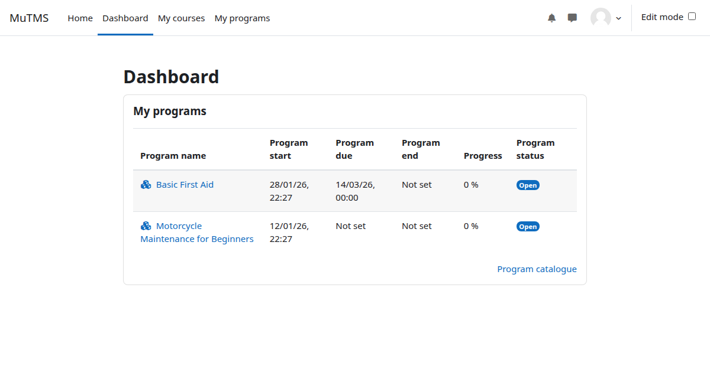

The *My programs* block can be added to the Moodle dashboard to give learners
quick access to their allocated programs without navigating away from the
dashboard. It displays program names and links to program details, making it
easy to monitor progress at a glance.

