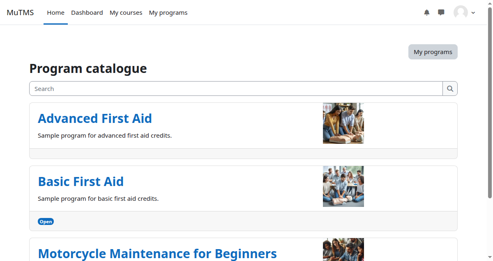

:::note
The Program catalogue will be replaced by a Universal catalogue plugin in a future release.
:::

The Program catalogue is a central place where learners can browse available
programs and their associated courses. Depending on a program's settings,
learners may be able to self-allocate, request allocation, or simply browse
the available content.

The catalogue can be accessed from the [My Programs page](../my-programs-page/)
and always adheres to tenant separation rules. Archived programs are never
visible in the catalogue. Visibility settings are managed in
[Program management](../management/#program-visibility).

