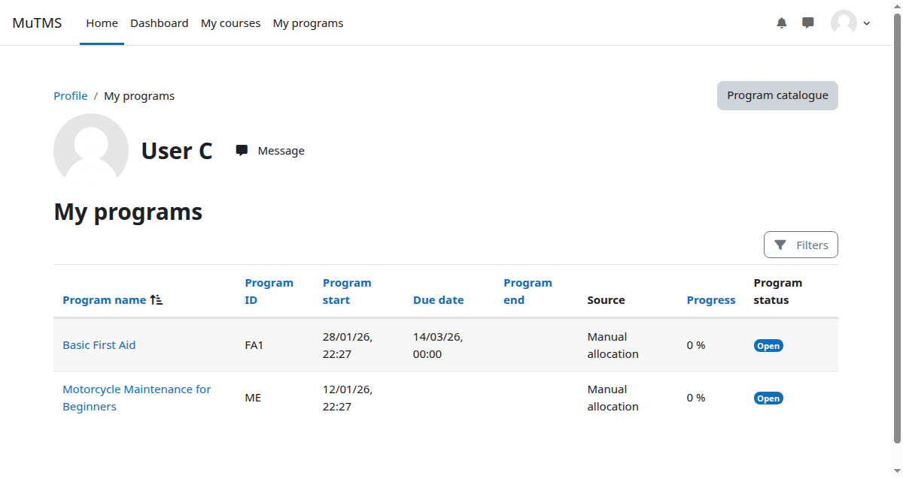
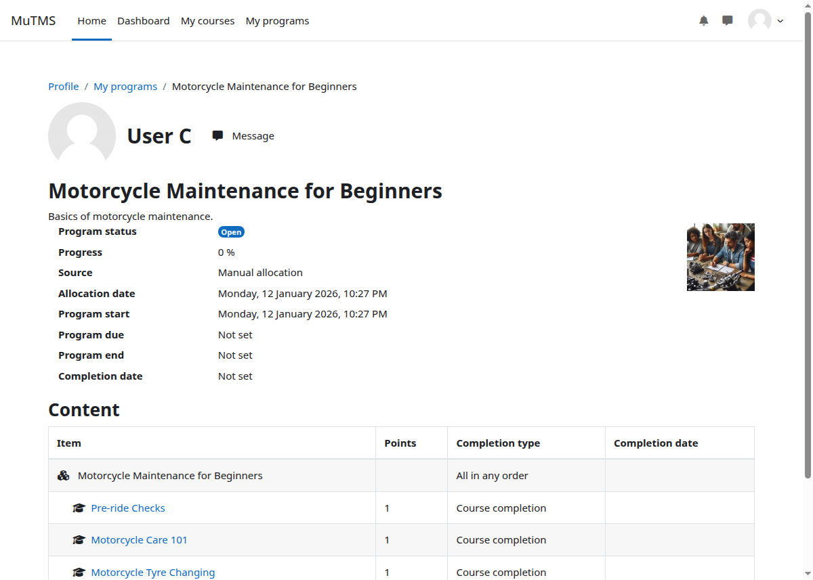

The **My programs** page on the user profile shows all programs a learner is
currently allocated to. Archived programs and archived allocations are not
shown.

Learners can track their progress in individual programs by clicking the
respective program link.

:::note
The **My programs** menu option can be removed by disabling the **My programs overview page** block
in **Site administration > Plugins > Blocks > Manage blocks**.
:::
